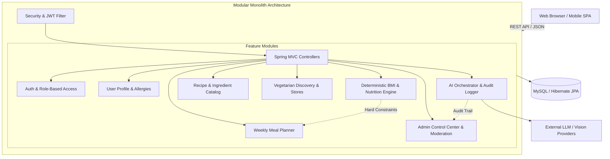

<div align="center">

# 🌿 VEGEAI
### Intelligent Vegetarian & Vegan Nutrition Ecosystem

[](https://github.com/Arkstar2212/SWP391-VEGEAI-Project)
[](https://www.oracle.com/java/)
[](https://spring.io/projects/spring-boot)
[](docs/ARCHITECTURE.md)
[](https://www.mysql.com/)
[](LICENSE)

<p align="center">
  <b>A production-grade, full-stack platform empowering vegetarian & vegan lifestyles through personalized meal planning, deterministic nutrition calculations, computer-vision ingredient analysis, and responsible AI governance.</b>
</p>

[Explore Documentation](docs/ARCHITECTURE.md) • [User Stories & Specs](VEGEAI_User_Stories_Requirements_Specification.md) • [Product PRD](PRD.md) • [Interactive Prototype](Demo_UI_Prototype_Interactive.html)

---

</div>

## 📌 Executive Summary

**VEGEAI** is engineered to address the core challenges of plant-based eating: nutritional deficiency risks, meal planning monotony, ingredient sourcing, and unverified AI nutrition hallucinations. 

Unlike brittle prototypes, VEGEAI is designed as an **Enterprise Modular Monolith** combining:
- **Deterministic Nutritional Engine:** Exact mathematical calculations for BMI, BMR, and daily calorie targets (no hallucinated AI math).
- **AI Nutrition Assistant:** Structured conversational assistant powered by Google Gemini with strict guardrails and rate-limiting.
- **Smart Meal Planner:** Automated weekly calendars that respect dietary restrictions (Vegan, Lacto-Ovo, Buddhist vegetarian) and hard allergen exclusions.
- **Vegetarian Discovery:** Location-aware directory of plant-based restaurants and specialty grocery stores.
- **Admin AI Observability:** Real-time metrics dashboard, AI audit trails, token monitoring, and human-in-the-loop content moderation queue.

---

## 🏛️ System Architecture: Modular Monolith

VEGEAI avoids the unnecessary latency, memory overhead, and distributed transaction pitfalls of microservices by employing a **Domain-Driven Modular Monolith**:



> 📖 **Deep Dive:** Read our full architectural rationale comparing Modular Monolith vs. Microservices in [docs/ARCHITECTURE.md](docs/ARCHITECTURE.md).

---

## 🚀 Key Modules & Feature Highlights

| Module | Key Capabilities | Compliance & Safety |
| :--- | :--- | :--- |
| **Auth & Security** | JWT (Stateless), BCrypt hashing, Role-Based Access (Guest, Member, Admin) | OWASP top 10 protected, input sanitization |
| **Deterministic Nutrition** | BMI, BMR, Calorie targets, Macronutrient balance | 100% deterministic Java logic; never trusted to LLM hallucination |
| **AI Nutritionist** | 24/7 vegetarian meal advice, meat alternatives recommendation | Token rate-limited, medical disclaimer enforced |
| **Smart Meal Planner** | 7-day personalized meal calendar, auto-generated shopping lists | Hard allergen filters (Peanuts, Gluten, Soy, etc.) |
| **Ingredient Vision** | Photo-to-ingredient recognition, freshness estimation | Multi-label computer vision with confidence scores |
| **Admin Governance** | AI token tracker, moderation queue, user audit logs | Human-in-the-loop override for AI decisions |

---

## 📁 Repository Structure

```text
SWP391_FA26_VEGEAI_PROJECT/
├── .github/
│   ├── workflows/ci.yml             # GitHub Actions automated build & test pipeline
│   ├── ISSUE_TEMPLATE/              # Bug report & Feature request issue forms
│   └── PULL_REQUEST_TEMPLATE.md     # Standardized code review checklist
├── .agents/                         # Autonomous engineering agent skills & rules
├── docs/
│   ├── ARCHITECTURE.md              # Architectural blueprint & monolith justification
│   └── SWP391_WEEK1_ANALYSIS.md     # Analysis, test cases & AI usage guidelines
├── harness/                         # End-to-end testing harness (Playwright)
├── src/
│   ├── main/
│   │   ├── java/com/example/swp391_fa26_vegeai_project/
│   │   │   ├── Swp391Fa26VegeaiProjectApplication.java
│   │   │   ├── common/              # Cross-cutting concerns (Security, Exceptions, DTOs)
│   │   │   │   ├── config/          # SecurityConfig, CorsConfig, OpenApiConfig
│   │   │   │   ├── dto/             # ApiResponse<T>, PageResponse<T>
│   │   │   │   ├── entity/          # BaseEntity (@MappedSuperclass)
│   │   │   │   └── exception/       # GlobalExceptionHandler, AppException, ErrorCode
│   │   │   └── modules/             # High-cohesion domain modules
│   │   │       ├── auth/            # Authentication & Registration
│   │   │       ├── user/            # Profile & Preferences
│   │   │       ├── nutrition/       # Deterministic BMI & Calorie Calculator
│   │   │       ├── recipe/          # Vegetarian Recipe Catalog
│   │   │       ├── mealplan/        # 7-Day Meal Planning Engine
│   │   │       ├── restaurant/      # Vegetarian Discovery
│   │   │       ├── ai/              # LLM Chatbot, Vision, & Audit Logs
│   │   │       └── admin/           # Platform Metrics & Moderation Queue
│   │   └── resources/
│   │       ├── static/              # Interactive UI Prototype & Assets
│   │       └── application.properties
│   └── test/                        # Unit and integration test suites
├── Demo_UI_Prototype_Interactive.html# Self-contained browser prototype
├── PRD.md                           # Product Requirements Document
├── pom.xml                          # Maven dependencies & build configurations
└── README.md                        # Master project documentation
```

---

## ⚡ Quickstart & Local Setup

### Prerequisites
- **Java Development Kit (JDK):** Version 21 LTS
- **Build Tool:** Apache Maven 3.9+ (or use the included `./mvnw` wrapper)
- **Database:** MySQL 8.0+ (or default in-memory for testing)

### 1. Clone the Repository
```bash
git clone https://github.com/Arkstar2212/SWP391-VEGEAI-Project.git
cd SWP391-VEGEAI-Project
```

### 2. Configure Database
Update `src/main/resources/application.properties` with your database credentials:
```properties
spring.datasource.url=jdbc:mysql://localhost:3306/vegeai_db?createDatabaseIfNotExist=true
spring.datasource.username=root
spring.datasource.password=your_password
spring.jpa.hibernate.ddl-auto=update
```

### 3. Build & Run the Application
```bash
# Compile and run tests
./mvnw clean compile

# Run Spring Boot backend
./mvnw spring-boot:run
```

The server will initialize on: `http://localhost:8080`

### 4. Explore the Interactive Prototype
Open `http://localhost:8080/index.html` or double-click `Demo_UI_Prototype_Interactive.html` in your browser to test all 3 portals:
- **Public / Guest:** Browse recipes, try limited AI nutritionist trial, calculate BMI.
- **Authorized Member:** Weekly meal planner, grocery generator, custom recipe creator.
- **Administrator:** AI log viewer, moderation review queue, system health metrics.

---

## 📡 Core API Reference

| HTTP Method | Endpoint | Description | Auth Required |
| :--- | :--- | :--- | :--- |
| `POST` | `/api/auth/register` | Register new user with dietary preferences | No |
| `POST` | `/api/auth/login` | Authenticate and obtain JWT token | No |
| `POST` | `/api/nutrition/bmi/calculate`| Deterministic BMI & healthy weight calculation | No |
| `GET` | `/api/recipes` | List published vegetarian/vegan recipes | No |
| `POST` | `/api/ai/chat` | Query the AI Nutrition Assistant (rate-limited) | Optional |
| `GET` | `/api/admin/dashboard/stats`| Retrieve real-time platform & AI telemetry | `ROLE_ADMIN` |

---

## 🛡️ Responsible AI & Security Compliance

1. **Deterministic Separation:** Mathematical nutrition metrics are never generated via LLM inference; they use audited formulas.
2. **AI Audit Trail:** Every model invocation is permanently recorded with latency, token usage, and moderation flags.
3. **Data Privacy:** Sensitive biometric metrics (weight, health conditions, allergies) are isolated to user scope and never exposed across accounts.
4. **Allergen Hard Constraint:** When the Meal Planner suggests recipes, hard allergen exclusions always override recommendation scoring.

---

## 👥 Course & Team Information

- **Course:** SWP391 — Software Development Project
- **Cohort / Class:** SE1912 | Semester: Fall 2026 / Spring 2026
- **Project Name:** VEGEAI (Vegetarian AI Platform)
- **Supervision & Mentorship:** FPT University Software Engineering Department

---

## 📄 License

This project is licensed under the terms of the [MIT License](LICENSE).
