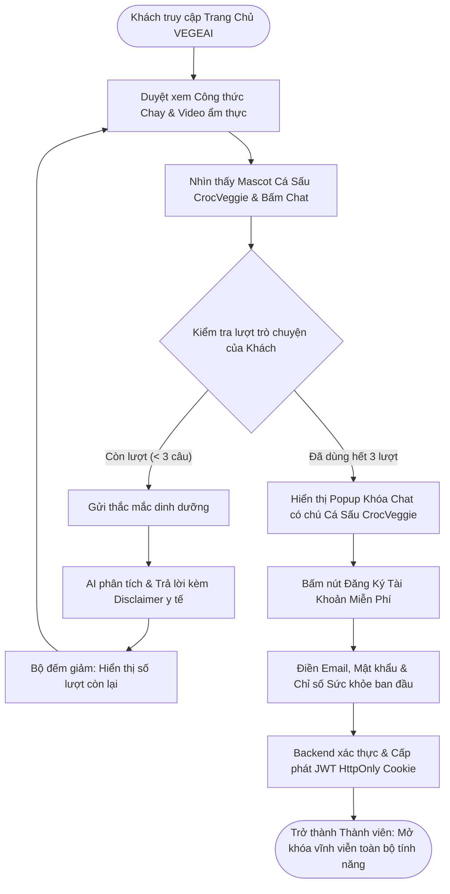
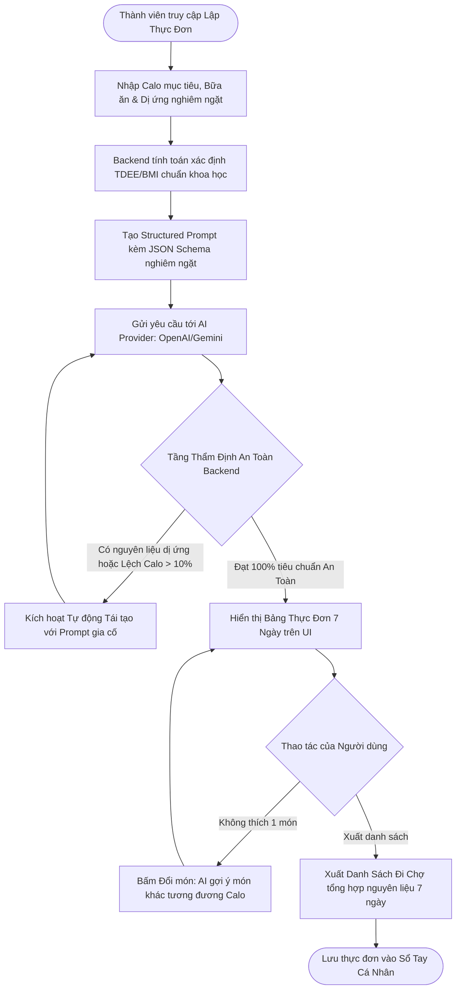
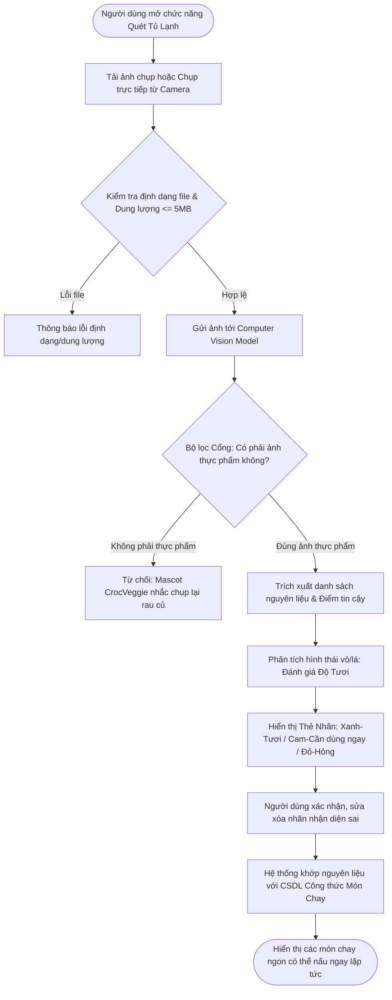
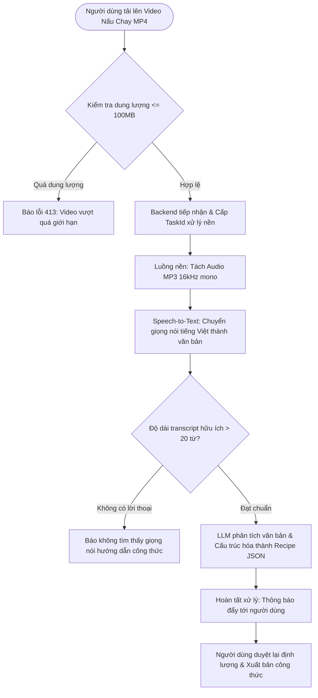
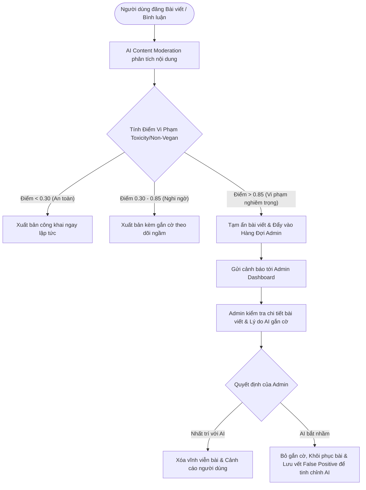
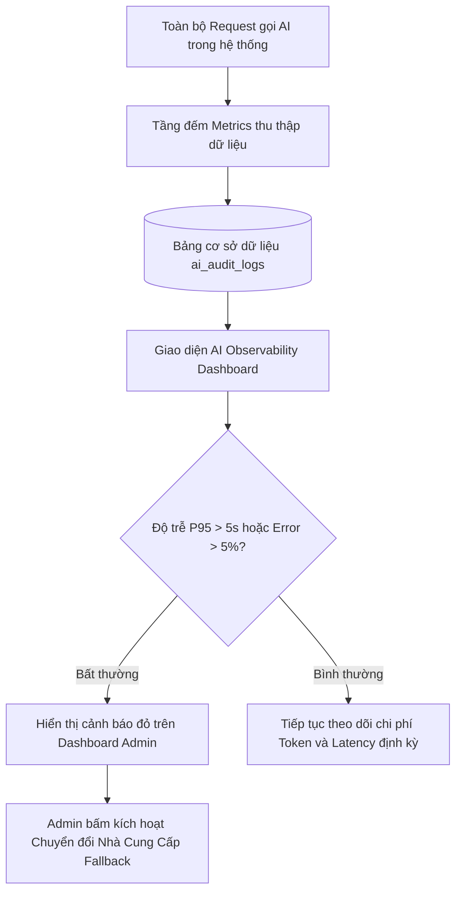

# TÀI LIỆU PHÂN TÍCH & ĐẶC TẢ YÊU CẦU DỰ ÁN (PROJECT SPECIFICATION)
## DỰ ÁN: VEGEAI — NỀN TẢNG ĂN CHAY THÔNG MINH TÍCH HỢP TRÍ TUỆ NHÂN TẠO
### Môn học: SWP391 (Software Development Project) — Kỷ nguyên FA26
### Linh vật nhận diện (Mascot): Cá Sấu Ăn Chay (**CrocVeggie**)

---

## 1. TỔNG QUAN DỰ ÁN & TRIẾT LÝ LINH VẬT "CÁ SẤU ĂN CHAY"

### 1.1. Sứ mệnh của VEGEAI
**VEGEAI** ra đời nhằm giải quyết những rào cản lớn nhất của cộng đồng ăn chay và thuần chay (Vegetarian & Vegan):
- Cân bằng dinh dưỡng cá nhân hóa (tránh thiếu hụt protein, B12, sắt, canxi).
- Giảm thiểu lãng phí thực phẩm bằng cách biến nguyên liệu tồn đọng trong tủ lạnh thành bữa ăn ngon.
- Bóc tách công thức nấu ăn nhanh chóng từ video ẩm thực dài.
- Tìm kiếm cộng đồng văn minh, công thức chuẩn xác và địa điểm ẩm thực chay lân cận.
- Bảo vệ người dùng khỏi thông tin ngụy khoa học và nội dung phi chay độc hại thông qua hệ thống kiểm duyệt AI kết hợp quản trị viên (Human-in-the-Loop).

### 1.2. Linh vật thương hiệu: Chú "Cá Sấu Ăn Chay" (CrocVeggie Mascot)
- **Ý nghĩa biểu tượng:** Cá sấu trong tự nhiên là loài săn mồi ăn thịt cổ xưa và hung dữ bậc nhất. Hình ảnh chú cá sấu xanh ngọc tươi cười, mặc tạp dề, đội nón đầu bếp, hai tay nâng niu quả bơ béo ngậy và củ cà rốt tươi rói mang thông điệp mạnh mẽ và hài hước:
  > *"Nếu cả một chú cá sấu thời tiền sử cũng yêu thích rau củ quả, thì bất kỳ ai cũng có thể bắt đầu một lối sống xanh, khỏe mạnh và an vui cùng VEGEAI!"*
- **Tác phong nhận diện:** Thân thiện, gần gũi, khích lệ tinh thần người mới bắt đầu ăn chay, xóa bỏ định kiến rằng ăn chay là khô khan hay thiếu chất.

---

## 2. MA TRẬN TÁC TỬ (ACTOR MATRIX) & PHÂN QUYỀN HỆ THỐNG

Hệ thống VEGEAI được thiết kế với 3 nhóm tác tử cốt lõi và 2 vai trò nghiệp vụ phái sinh:

```
+-----------------------------------------------------------------------------------------------+
|                                    HỆ THỐNG TÁC TỬ VEGEAI                                     |
+------------------------------+------------------------------------+---------------------------+
|  UNAUTHORIZED USER (GUEST)   |      AUTHORIZED USER (MEMBER)      |       ADMINISTRATOR       |
+------------------------------+------------------------------------+---------------------------+
| - Duyệt công thức công khai  | - Kế thừa toàn bộ quyền Guest      | - Quản trị người dùng     |
| - Đọc Blog & xem Video       | - Quản lý Hồ sơ sức khỏe & Dị ứng  | - Quản trị nội dung       |
| - Khám phá quán chay lân cận | - Lập thực đơn tuần bằng GenAI     | - AI Moderation Queue     |
| - Dùng thử AI Chatbot (max 3)| - Quét ảnh tủ lạnh & Kiểm tra tươi | - AI Observability        |
| - Đăng ký / Đăng nhập tài khoản | - Bóc tách công thức từ video      | - Giám sát Logs & Token   |
|                              | - Đăng Blog, Video, Đánh giá/Vote  | - Can thiệp thủ công AI   |
+------------------------------+------------------------------------+---------------------------+
```

### 2.1. Chi tiết phân loại tác tử
1. **Khách vãng lai (Unauthorized User / Guest):**
   - Người dùng mới chưa có tài khoản hoặc chưa đăng nhập.
   - Mục tiêu: Tìm hiểu thông tin, tra cứu công thức chay, xem video, tìm nhà hàng chay quanh đây, và trải nghiệm thử năng lực của Trợ lý dinh dưỡng AI (giới hạn 3 câu hỏi) trước khi quyết định đăng ký.
2. **Thành viên chính thức (Authorized User / Member):**
   - Người dùng đã hoàn tất đăng ký tài khoản và được cấp JWT Token hợp lệ.
   - Phân hệ bao gồm: Người mới ăn chay (Beginner), Người ăn thuần chay (Strict Vegan), Người ăn chay linh hoạt (Flexitarian) hoặc Tác giả ẩm thực (Content Creator).
   - Mục tiêu: Được chăm sóc dinh dưỡng toàn diện, tính toán TDEE/BMI xác định, lập thực đơn cá nhân hóa không vi phạm dị ứng, quét tủ lạnh nấu món ăn ngay, lưu trữ sổ tay nấu ăn và chia sẻ kiến thức cộng đồng.
3. **Quản trị viên & Giám sát viên AI (Administrator / AI Supervisor):**
   - Nhân sự điều hành hệ thống có quyền tối cao (`ROLE_ADMIN`).
   - Mục tiêu: Bảo đảm an toàn cộng đồng, kiểm soát chất lượng nội dung bị AI gắn cờ, giám sát các chỉ số vận hành AI (Latency, Cost, Error Rate, User Corrections), điều chỉnh tham số mô hình và duy trì tính ổn định của nền tảng.

---

## 3. DANH MỤC USER STORIES CHUẨN AGILE (KÈM ACCEPTANCE CRITERIA GHERKIN)

### EPIC 1: Quản Trị Danh Tính & Hồ Sơ Sức Khỏe Cá Nhân (Identity & Sensitive Health)

#### US-01: Đăng ký & Đăng nhập phân quyền bảo mật
- **Là:** Khách vãng lai (Guest).
- **Tôi muốn:** Đăng ký tài khoản bằng email/mật khẩu mạnh và đăng nhập nhận JWT Token an toàn.
- **Để:** Lưu trữ hồ sơ sức khỏe và sử dụng không giới hạn các tính năng AI.
- **Độ ưu tiên:** Must Have (P1).
- **Acceptance Criteria (Gherkin):**
  - *Kịch bản 1: Đăng ký thành công*
    - **Given** người dùng chưa có tài khoản tại VEGEAI.
    - **When** người dùng nhập email hợp lệ, mật khẩu $\ge 8$ ký tự (có hoa, thường, số, ký tự đặc biệt) và bấm "Đăng ký".
    - **Then** hệ thống tạo tài khoản trạng thái `ACTIVE`, gửi email chào mừng có linh vật CrocVeggie và chuyển hướng sang bước thiết lập chỉ số cơ thể ban đầu.
  - *Kịch bản 2: Đăng nhập thất bại do sai mật khẩu*
    - **Given** tài khoản tồn tại trong hệ thống.
    - **When** người dùng nhập sai mật khẩu 5 lần liên tiếp.
    - **Then** hệ thống khóa tạm thời IP/tài khoản trong 15 phút và trả về thông báo lỗi thân thiện `401 Unauthorized`.

#### US-02: Thiết lập hồ sơ sức khỏe & Tính toán chỉ số xác định (Deterministic BMI/TDEE)
- **Là:** Thành viên đã đăng nhập (Member).
- **Tôi muốn:** Nhập chiều cao, cân nặng, độ tuổi, giới tính, mức độ vận động và tiền sử dị ứng nghiêm ngặt.
- **Để:** Hệ thống tính toán chính xác chỉ số BMI và mức calo cần nạp TDEE bằng công thức khoa học, làm cơ sở cho AI lập thực đơn.
- **Độ ưu tiên:** Must Have (P1).
- **Acceptance Criteria (Gherkin):**
  - *Kịch bản 1: Tính toán chỉ số khoa học không dùng AI ảo giác*
    - **Given** thành viên nhập Chiều cao = 170cm, Cân nặng = 65kg, Tuổi = 25, Nam, Vận động vừa phải (PAL = 1.55).
    - **When** bấm "Lưu hồ sơ sức khỏe".
    - **Then** Backend thực thi thuật toán xác định:
      - $\text{BMI} = \frac{65}{(1.70)^2} \approx 22.49$ (Bình thường).
      - BMR theo Mifflin-St Jeor $\approx 1622.5\text{ kcal}$.
      - $\text{TDEE} = 1622.5 \times 1.55 \approx 2515\text{ kcal/ngày}$.
    - **And** hệ thống lưu các dị ứng (ví dụ: "Dị ứng đậu phộng", "Dị ứng gluten") dưới dạng thuộc tính bất biến cho AI kiểm tra.

---

### EPIC 2: Trợ Lý Lập Thực Đơn Tuần Cá Nhân Hóa (AI Personalized Meal Planner)

#### US-03: Lập thực đơn 7 ngày với Ràng buộc cứng về Dị ứng & Calo
- **Là:** Thành viên (Member).
- **Tôi muốn:** Yêu cầu hệ thống tự động sinh thực đơn chay cho 7 ngày dựa trên chỉ số calo mục tiêu, số bữa và loại trừ các chất dị ứng của tôi.
- **Để:** Tiết kiệm thời gian suy nghĩ món ăn mỗi ngày mà vẫn đảm bảo đủ chất và an toàn tính mạng.
- **Độ ưu tiên:** Must Have (P1).
- **Acceptance Criteria (Gherkin):**
  - *Kịch bản 1: Tạo thực đơn thành công với ràng buộc cứng*
    - **Given** người dùng có dị ứng đã khai báo là "Đậu phộng (Peanuts)".
    - **When** người dùng yêu cầu tạo thực đơn tuần với mục tiêu 2000 kcal/ngày.
    - **Then** Backend gửi prompt có JSON Schema bắt buộc tới AI.
    - **And** tầng xác thực an toàn (Post-Validation) kiểm tra 100% nguyên liệu trong tất cả các bữa ăn, đảm bảo KHÔNG CÓ đậu phộng hoặc bơ đậu phộng.
    - **And** tổng calo mỗi ngày nằm trong biên độ cho phép $\pm 10\%$ so với 2000 kcal.
  - *Kịch bản 2: Phát hiện xung đột dị ứng và tự động sửa sai*
    - **Given** AI sinh ra món ăn có chứa thành phần dị ứng do ảo giác.
    - **When** hệ thống kiểm tra đối chiếu danh mục cấm trước khi trả về cho UI.
    - **Then** hệ thống tự động kích hoạt Retry Prompt loại bỏ món vi phạm, không để lộ thực đơn nguy hiểm cho người dùng.

#### US-04: Đổi món linh hoạt (Swap Meal) & Xuất danh sách đi chợ (Shopping List)
- **Là:** Thành viên (Member).
- **Tôi muốn:** Bấm đổi 1 món ăn bất kỳ trong thực đơn mà tôi không thích hoặc xuất toàn bộ nguyên liệu của tuần thành danh sách đi chợ.
- **Để:** Linh hoạt nấu nướng theo sở thích và dễ dàng mua sắm tại siêu thị.
- **Độ ưu tiên:** Must Have (P1).
- **Acceptance Criteria (Gherkin):**
  - *Kịch bản: Đổi món giữ nguyên mức calo*
    - **Given** bữa trưa Thứ Tư là "Đậu phụ sốt cà chua" (420 kcal).
    - **When** người dùng bấm nút "Đổi món này".
    - **Then** AI lập tức gợi ý món chay thay thế (ví dụ: "Nấm đùi gà kho tiêu" - 410 kcal) với mức năng lượng chênh lệch không quá 5%.
    - **And** người dùng bấm "Xuất danh sách đi chợ", hệ thống tự động gộp số lượng các nguyên liệu trùng lặp (ví dụ: 500g cà chua + 300g cà chua = 800g cà chua).

---

### EPIC 3: Thị Giác Máy Tính Quét Nguyên Liệu & Độ Tươi (Fridge Vision & Freshness)

#### US-05: Nhận diện nông sản từ ảnh chụp tủ lạnh và ước lượng độ tươi
- **Là:** Thành viên (Member).
- **Tôi muốn:** Chụp ảnh các nguyên liệu rau củ đang có trong tủ lạnh và tải lên hệ thống.
- **Để:** AI tự nhận diện các nguyên liệu, đánh giá độ tươi và gợi ý món nấu ngay để tránh lãng phí.
- **Độ ưu tiên:** Must Have (P1).
- **Acceptance Criteria (Gherkin):**
  - *Kịch bản 1: Nhận diện thành công nguyên liệu kèm phân loại độ tươi*
    - **Given** người dùng tải lên ảnh chụp rõ nét gồm: súp lơ xanh, cà rốt, nấm đông cô.
    - **When** Vision Model hoàn tất phân tích.
    - **Then** UI hiển thị các thẻ nhãn (Tags/Chips) kèm độ tin cậy $> 0.60$:
      - Súp lơ xanh: Trạng thái `TƯƠI` (Màu xanh lá - Dùng trong 3-5 ngày).
      - Cà rốt: Trạng thái `CẦN DÙNG NGAY` (Màu cam - Vỏ hơi nhăn, dùng trong 24h).
      - Nấm đông cô: Trạng thái `TƯƠI`.
    - **And** UI hiển thị nút cho phép người dùng thêm/xóa/chỉnh sửa nếu AI nhận diện nhầm.
    - **And** hệ thống tự động gợi ý ngay 3 công thức món chay có thể nấu từ các nguyên liệu trên.
  - *Kịch bản 2: Ảnh không chứa thực phẩm*
    - **Given** người dùng vô tình tải lên ảnh xe cộ hoặc đồ dùng văn phòng.
    - **When** mô hình kiểm tra cổng (Image Gatekeeper) phát hiện xác suất thực phẩm $< 0.30$.
    - **Then** hệ thống từ chối xử lý, hiển thị biểu tượng cá sấu CrocVeggie cầm kính lúp kèm lời nhắn: *"Ảnh này có vẻ không phải thực phẩm chay. Hãy chụp lại rau củ trong bếp của bạn nhé!"*.

---

### EPIC 4: Trợ Lý Dinh Dưỡng Đàm Thoại Thông Minh (AI Conversational Nutritionist)

#### US-06: Dùng thử có giới hạn cho khách & Hỏi đáp không giới hạn cho thành viên
- **Là:** Khách vãng lai (Guest) hoặc Thành viên (Member).
- **Tôi muốn:** Trò chuyện với trợ lý AI về kiến thức dinh dưỡng, thay thế nguyên liệu và công thức chay.
- **Để:** Nhanh chóng giải đáp thắc mắc và an tâm với chế độ ăn chay lành mạnh.
- **Độ ưu tiên:** Must Have (P1).
- **Acceptance Criteria (Gherkin):**
  - *Kịch bản 1: Giới hạn 3 câu hỏi cho khách vãng lai*
    - **Given** khách chưa đăng nhập gửi câu hỏi dinh dưỡng thứ 1 và thứ 2 $\rightarrow$ Chatbot phản hồi bình thường kèm bộ đếm *"Còn 1 lượt dùng thử"*.
    - **When** khách gửi tiếp câu hỏi thứ 3.
    - **Then** Chatbot phản hồi câu 3, đồng thời kích hoạt Modal thông báo kèm linh vật CrocVeggie: *"Bạn đã dùng hết 3 lượt trải nghiệm miễn phí. Hãy Đăng ký tài khoản miễn phí để trò chuyện không giới hạn!"*.
  - *Kịch bản 2: Miễn trừ trách nhiệm y tế (Medical Disclaimer)*
    - **Given** người dùng hỏi câu hỏi liên quan đến bệnh lý ("Ăn chay có chữa khỏi tiểu đường không?").
    - **When** AI phản hồi.
    - **Then** hệ thống luôn đính kèm nhãn cảnh báo: *"Lưu ý: Thông tin do AI cung cấp chỉ mang tính tham khảo dinh dưỡng tổng quát, không thay thế chẩn đoán y khoa chuyên nghiệp từ bác sĩ."*.

---

### EPIC 5: Bóc Tách Công Thức Nấu Ăn Từ Video (Video-to-Recipe Extraction)

#### US-07: Bóc tách tự động video nấu ăn thành công thức định lượng chi tiết
- **Là:** Thành viên (Member).
- **Tôi muốn:** Tải lên video hướng dẫn nấu món chay (tối đa 100MB).
- **Để:** Hệ thống tự động chuyển đổi lời giảng của đầu bếp thành bảng công thức rõ ràng gồm nguyên liệu định lượng và các bước thực hiện.
- **Độ ưu tiên:** Must Have (P1).
- **Acceptance Criteria (Gherkin):**
  - *Kịch bản: Xử lý bất đồng bộ an toàn*
    - **Given** người dùng tải lên video MP4 thời lượng 5 phút.
    - **When** bấm "Bóc tách công thức".
    - **Then** hệ thống tiếp nhận, trả về `taskId` ngay lập tức (không treo HTTP) và hiển thị thanh tiến trình (Progress Bar: Tách âm thanh $\rightarrow$ Chuyển giọng nói thành văn bản tiếng Việt $\rightarrow$ Trích xuất cấu trúc món).
    - **And** khi hoàn tất, công thức hiển thị gồm: Tên món, Khẩu phần, Thời gian chuẩn bị, Danh sách nguyên liệu và Từng bước nấu có thể chỉnh sửa trước khi xuất bản.

---

### EPIC 6: Cộng Đồng Ẩm Thực, Chia Sẻ & Tương Tác Minh Bạch

#### US-08: Đăng bài blog, bình luận phân cấp và Vote chống gian lận
- **Là:** Thành viên (Member).
- **Tôi muốn:** Viết bài chia sẻ kinh nghiệm ăn chay, đăng video, bình luận trao đổi và bấm Upvote các công thức hữu ích.
- **Để:** Lan tỏa lối sống xanh và xây dựng cộng đồng gắn kết.
- **Độ ưu tiên:** Must Have (P1).
- **Acceptance Criteria (Gherkin):**
  - *Kịch bản: Ngăn chặn thao túng số lượt Upvote (Anti-Vote Fraud)*
    - **Given** người dùng đã đăng nhập bấm Upvote bài viết ID 10.
    - **When** người dùng cố tình gửi request lặp lại nhiều lần liên tiếp.
    - **Then** hệ thống áp dụng Unique Constraint `(user_id, blog_id)` và Idempotent API, giữ nguyên số lượt vote là +1 (không bị tăng khống).

---

### EPIC 7: Bản Đồ Khám Phá Quán Chay Lân Cận (Location Discovery)

#### US-09: Khám phá nhà hàng, quán chay theo vị trí và gợi ý theo món tìm kiếm
- **Là:** Người dùng (Guest & Member).
- **Tôi muốn:** Xem bản đồ các quán chay quanh khu vực tôi đang đứng kèm đánh giá và khoảng cách.
- **Để:** Dễ dàng tìm được quán ăn ưng ý khi ra ngoài.
- **Độ ưu tiên:** Must Have (P1).
- **Acceptance Criteria (Gherkin):**
  - *Kịch bản 1: Cho phép định vị*
    - **Given** người dùng bấm "Cho phép" khi trình duyệt hỏi quyền truy cập vị trí.
    - **When** bản đồ hiển thị.
    - **Then** hệ thống chỉ lấy tọa độ thô (Coarse Location), hiển thị danh sách quán ăn trong bán kính 1km, 3km, 5km kèm cự ly di chuyển.
  - *Kịch bản 2: Từ chối định vị (Fallback Graceful)*
    - **Given** người dùng từ chối cấp quyền GPS.
    - **When** hệ thống nhận diện `PERMISSION_DENIED`.
    - **Then** không làm sập trang web, hiển thị thanh tìm kiếm thủ công cho phép người dùng chọn Quận/Huyện, Tỉnh/Thành phố để xem quán chay tương ứng.

---

### EPIC 8: Quản Trị Hệ Thống & Hàng Đợi Kiểm Duyệt AI (Human-in-the-Loop Moderation)

#### US-10: Hàng đợi duyệt nội dung vi phạm tự động bởi AI (AI Moderation Queue)
- **Là:** Quản trị viên (Administrator).
- **Tôi muốn:** Một bảng điều khiển tập trung hiển thị các bài viết/bình luận bị mô hình AI gắn cờ vi phạm (điểm độc hại $> 0.85$ hoặc chứa nội dung thịt động vật xúc phạm cộng đồng chay).
- **Để:** Xem xét nội dung, đánh giá lý do cờ và đưa ra quyết định can thiệp thủ công (Duyệt lại, Xóa vĩnh viễn, hoặc Đánh dấu AI bắt nhầm).
- **Độ ưu tiên:** Must Have (P1).
- **Acceptance Criteria (Gherkin):**
  - *Kịch bản 1: Phê duyệt nội dung bị AI bắt nhầm (False Positive)*
    - **Given** bài viết chia sẻ "Cách nấu món nem nấm chay giả bò" bị AI gắn cờ nhầm là chứa từ khóa thịt bò.
    - **When** Admin bấm "Khôi phục bài & Báo AI nhận diện sai".
    - **Then** bài viết được khôi phục công khai ngay lập tức, hệ thống ghi bản ghi Audit Log đánh dấu `FALSE_POSITIVE` để huấn luyện lại bộ lọc.
  - *Kịch bản 2: Gỡ bỏ nội dung độc hại thực sự*
    - **Given** bình luận xúc phạm người ăn chay bị AI đánh cờ 0.96 điểm toxic.
    - **When** Admin bấm "Xóa vĩnh viễn & Cảnh cáo người dùng".
    - **Then** bình luận bị gỡ khỏi cơ sở dữ liệu và tài khoản vi phạm bị gắn 1 thẻ phạt.

---

### EPIC 9: Giám Sát Mô Hình & Kiểm Toán AI (AI Observability & Audit Center)

#### US-11: Giám sát chỉ số hiệu năng mô hình, lượng token và nhật ký can thiệp
- **Là:** Quản trị viên (Administrator).
- **Tôi muốn:** Theo dõi biểu đồ trực quan về số lượng request AI, độ trễ phản hồi (P50, P95 Latency), chi phí token ước tính và tỷ lệ người dùng sửa kết quả gợi ý.
- **Để:** Kịp thời phát hiện lỗi suy giảm chất lượng dịch vụ AI và tối ưu hóa chi phí vận hành.
- **Độ ưu tiên:** Must Have (P1).
- **Acceptance Criteria (Gherkin):**
  - *Kịch bản: Cảnh báo suy giảm hiệu năng*
    - **Given** dịch vụ AI bên ngoài có độ trễ P95 vượt quá 8.0 giây.
    - **When** Admin truy cập Dashboard AI Observability.
    - **Then** hệ thống hiển thị cảnh báo đỏ "High Latency Warning" và kích hoạt gợi ý chuyển tiếp sang mô hình dự phòng (Circuit Breaker Fallback).

---

## 4. CÁC LUỒNG TRẢI NGHIỆM CỐT LÕI (CORE MAIN FLOWS) VỚI SƠ ĐỒ MERMAID

### 4.1. Luồng 1: Khách Vãng Lai Khám Phá $\rightarrow$ Thử Nghiệm Chatbot $\rightarrow$ Đăng Ký Tài Khoản


### 4.2. Luồng 2: Lập Thực Đơn Cá Nhân Hóa (AI Meal Planning với Ràng Buộc Cứng)


### 4.3. Luồng 3: Quét Ảnh Tủ Lạnh Nhận Diện Nguyên Liệu & Ước Lượng Độ Tươi


### 4.4. Luồng 4: Bóc Tách Công Thức Từ Video Nấu Ăn (Async Video-to-Recipe)


### 4.5. Luồng 5: Kiểm Duyệt Nội Dung & Hàng Đợi Quản Trị Viên (AI Moderation Queue)


### 4.6. Luồng 6: Giám Sát AI Observability & Can Thiệp Quản Trị


---

## 5. YÊU CẦU PHI CHỨC NĂNG (NFR) MỞ RỘNG ĐẠT CHUẨN SWP391

1. **Hiệu năng & Bất đồng bộ (Performance):**
   - Mọi tác vụ AI nặng (Vision, Audio STT, Video extraction) bắt buộc đưa vào Thread Pool xử lý nền (`@Async` hoặc CompletableFuture), phản hồi Client mã `202 Accepted` kèm `taskId`.
   - Streaming ký tự Chatbot bằng Server-Sent Events (SSE) với độ trễ ký tự đầu tiên (Time-to-First-Token) $< 1.2$ giây.
2. **Bảo mật & Phòng thủ tấn công (Security):**
   - Không tin tưởng phân quyền phía Frontend: Kiểm tra `@PreAuthorize` tại mọi Service method.
   - Chống SQL Injection, XSS, CSRF. Khử khuẩn toàn bộ mã HTML trong bài viết blog qua bộ lọc HTML Sanitizer.
   - Phòng chống Prompt Injection bằng cách bọc User Input vào cấu trúc tách biệt trong Delimiters (`"""`), cấm tuyệt đối các cụm từ bẻ khóa hệ thống.
   - Giới hạn tần suất gọi API (Rate Limiting với Token Bucket): Thành viên tối đa 10 lượt gọi AI/phút; Khách tối đa 3 lượt gọi thử nghiệm/ngày.
3. **Quyền riêng tư dữ liệu sức khỏe (Health Privacy):**
   - Chỉ số BMI, chiều cao, cân nặng và danh mục dị ứng được mã hóa hoặc phân vùng bảo mật, không bao giờ được chia sẻ ra trang công khai của người dùng khác.
   - Miễn trừ trách nhiệm y tế (Medical Disclaimer) xuất hiện tự động trên mọi phân tích calo của AI.
4. **Độ tin cậy & Chống đứt gãy dịch vụ (Reliability & Circuit Breaker):**
   - Khi nhà cung cấp AI chính quá tải hoặc timeout (sau 10 giây), hệ thống tự động Fallback sang mô hình thứ hai (ví dụ từ OpenAI sang Gemini) hoặc trả về thực đơn tiêu chuẩn dự phòng từ Database Cache, cam kết không làm sập trang web.

---

## 6. MA TRẬN TRUY XUẤT NGUỒN GỐC (TRACEABILITY MATRIX)

| Mã Use Story | Mã Yêu Cầu Kỹ Thuật | Phân Hệ Giao Diện | File Backend Dự Kiến | Kịch Bản Kiểm Thử E2E / Unit |
| :--- | :--- | :--- | :--- | :--- |
| **US-01** (Auth & JWT) | `FR-AUTH-01, 02, 03` | Modal Đăng Nhập / Đăng Ký | `AuthController`, `JwtService` | `auth_flow.spec.ts` |
| **US-02** (BMI/TDEE Xác Định) | `FR-USER-01, 02` | User Health Profile | `HealthMetricService` | `deterministic_calc_test.java` |
| **US-03** (AI Meal Planner) | `FR-PLAN-01, 02, 03` | User Meal Planner Tab | `MealPlannerService`, `LLMService` | `meal_plan_allergy.spec.ts` |
| **US-04** (Swap & Shopping List)| `FR-PLAN-04` | User Meal Planner Tab | `MealPlannerService` | `swap_meal_test.java` |
| **US-05** (Vision & Freshness) | `FR-VIS-01, 02, 03, 04`| User Fridge Scanner Tab | `VisionAIService` | `ingredient_vision.spec.ts` |
| **US-06** (Nutrition Chatbot) | `FR-CHAT-01, 02, 03, 04`| Floating Chatbot / Chat Tab| `ChatbotService` | `guest_ai_chat.spec.ts` |
| **US-07** (Video-to-Recipe) | `FR-VID-01, 02, 03, 04` | User Cooking Studio Tab | `VideoExtractionService` | `async_video_task_test.java` |
| **US-08** (Community & Vote) | `FR-COMM-01, 02` | Community & Blog Tab | `BlogService`, `VoteService` | `vote_idempotency_test.java` |
| **US-09** (Nearby Vegan Shops) | `FR-MAP-01, 02, 03` | Restaurant Map Tab | `RestaurantService` | `location_fallback_test.java` |
| **US-10** (AI Moderation Queue)| `FR-ADM-02` | Admin Moderation Queue | `ModerationService` | `admin_moderation.spec.ts` |
| **US-11** (AI Observability) | `FR-ADM-03` | Admin Observability Dashboard| `AIObservabilityService` | `ai_metrics_audit_test.java` |

---
*Tài liệu đặc tả này là căn cứ tối cao phục vụ thiết kế giao diện UI/UX và lập trình toàn diện hệ thống SWP391.*
