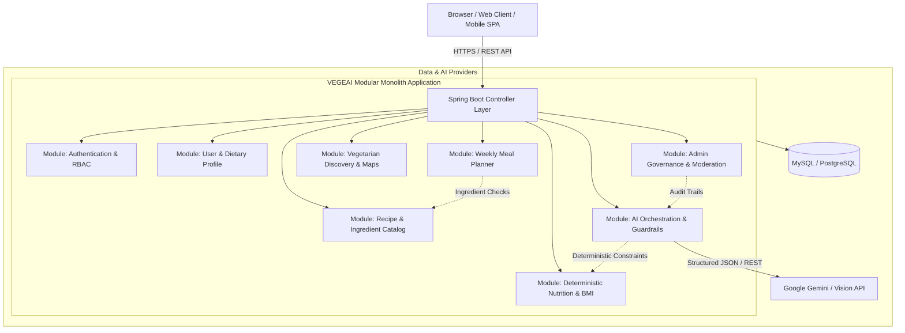

# VEGEAI System Architecture & Engineering Blueprint

## 1. Architectural Philosophy: Why Modular Monolith?

During initial planning, standard enterprise options were evaluated: **Microservices** vs. **Modular Monolith**.

### 1.1 The Microservices Anti-Pattern for Course / Agile Team Projects
As seen in traditional enterprise projects, splitting a small-to-medium platform into 10+ services (`ApiGateway`, `AuthService`, `DiscoveryServer`, `Movie/RecipeService`, `NotificationService`, `StatisticService`) creates severe drawbacks:
- **Massive RAM & CPU Footprint:** Running 10-12 JVM processes consumes 8-12 GB of memory on a local developer laptop just to idle.
- **Distributed Failure & Latency:** Internal HTTP/gRPC calls introduce serialization overhead, connection timeouts, and cascading failures.
- **Distributed Transaction Complexity:** Implementing Saga patterns or Two-Phase Commits (2PC) for simple user-mealplan updates is notoriously error-prone.
- **DevOps Burden:** Requires Kubernetes/Docker Compose orchestration, centralized log collectors, and complex service discovery configurations.

### 1.2 The Modular Monolith Advantage
VEGEAI implements a **Domain-Driven Modular Monolith (DDD)**:
- **Single Deployable Artifact:** One Spring Boot JAR runs the entire application with minimal memory footprint (< 350 MB) and sub-3-second startup.
- **In-Process Performance:** Cross-domain operations execute via zero-latency Java method calls instead of network hops.
- **ACID Integrity:** Database operations share a unified transactional boundary (`@Transactional`) ensuring data consistency without distributed locks.
- **Strict Domain Isolation:** Package encapsulation prevents tight coupling, allowing future extraction into standalone microservices if organizational scale demands it.



---

## 2. Package Convention & Responsibilities

```text
com.example.swp391_fa26_vegeai_project/
├── common/             # Cross-cutting concerns (Security, Exception, Base DTOs/Entities)
│   ├── config/         # Spring Security, CORS, OpenAPI Swagger
│   ├── dto/            # ApiResponse<T>, PageResponse<T>
│   ├── entity/         # BaseEntity (@MappedSuperclass)
│   ├── exception/      # GlobalExceptionHandler, AppException, ErrorCode
│   └── security/       # JWT filters, UserPrincipal
└── modules/            # Isolated business domains
    ├── auth/           # Login, Register, Refresh Token
    ├── user/           # Profiles, Dietary restrictions, Allergies
    ├── nutrition/      # Deterministic BMI, BMR, Calorie targets
    ├── recipe/         # Vegetarian/vegan recipes, categories, ingredients
    ├── mealplan/       # Weekly calendar, meal assignments
    ├── restaurant/     # Vegetarian restaurant directory & locations
    ├── ai/             # Chatbot, Image recognition, Content moderation, Audit log
    └── admin/          # Platform telemetry, AI model logs, User moderation
```

---

## 3. Engineering & AI Principles

1. **Deterministic Nutrition First:** Mathematical equations (BMI, Harris-Benedict BMR, Macronutrient caloric split) are strictly computed by Java business logic. AI explains or suggests recipes, but NEVER invents or overrides hard physiological numbers.
2. **Untrusted AI Guardrails:** All inputs to and outputs from external LLMs are sanitized. Content moderation checks run before persisting user content.
3. **Audit Trail Compliance:** Every AI interaction records model version, prompt summary, latency, token count, and moderation flag in `ai_audit_logs`.
