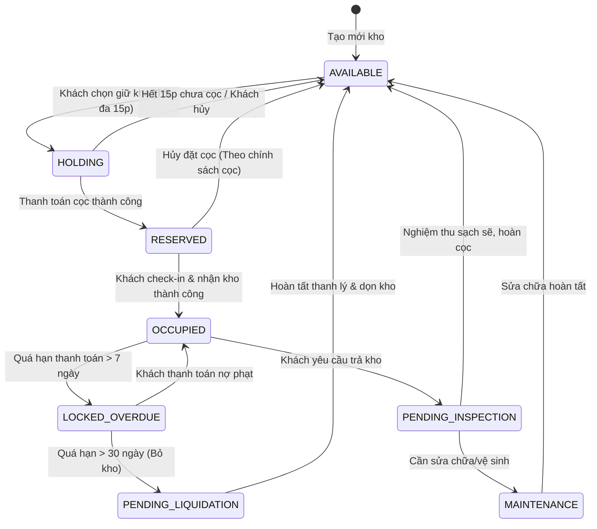
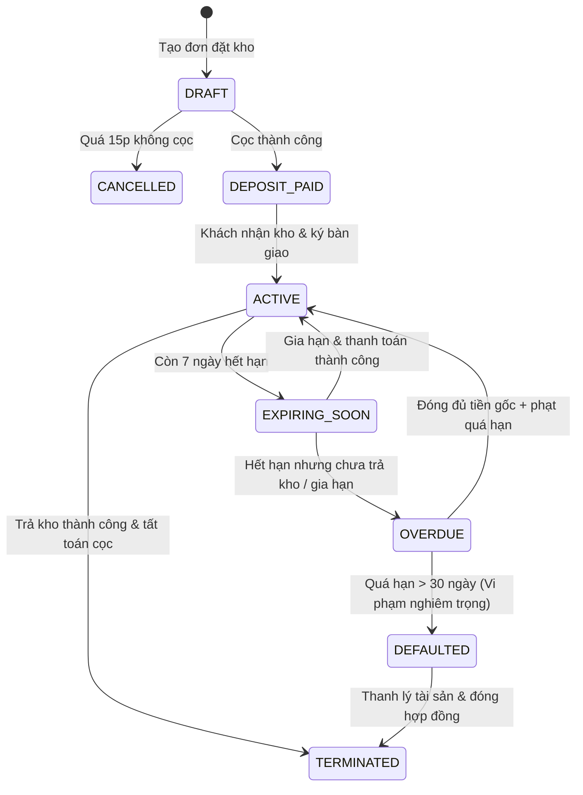

# TÀI LIỆU PHÂN TÍCH TUẦN 1 & CHIẾN LƯỢC SỬ DỤNG AI TRONG SWP391
## Dự án: Self-Storage Facility Rental and Management System
**Đề tài:** Hệ thống quản lý và cho thuê kho lưu trữ tự phục vụ (Mã đề: QuynhTNN4)  
**Lớp:** SE1912 | **Kỳ thực hiện:** Fall 2026 / Spring 2026

---

## MỤC LỤC
1. [Chiến Lược Dùng AI "Ngược Dòng" Từ Test Cases Để Tránh Sót Tính Năng](#1-chiến-lược-dùng-ai-ngược-dòng-từ-test-cases)
2. [Quy Chuẩn Ghi Chép AI Logs Môn SWP391 (Mẫu Chuẩn SE1912)](#2-quy-chuẩn-ghi-chép-ai-logs)
3. [Phạm Vi Dự Án (Project Scope: In-Scope vs Out-of-Scope)](#3-phạm-vi-dự-án-project-scope)
4. [Danh Sách Tính Năng Chi Tiết (Backlog) Theo 7 Flows & 5 Actors](#4-danh-sách-tính-năng-chi-tiết)
5. [Yêu Cầu Phi Chức Năng (Non-Functional Requirements - NFR)](#5-yêu-cầu-phi-chức-năng-nfr)
6. [Ma Trận Ngoại Lệ & Kịch Bản Lỗi (Exceptions & Edge Cases)](#6-ma-trận-ngoại-lệ--kịch-bản-lỗi)
7. [User Flows & State Machine Diagrams](#7-user-flows--state-machine-diagrams)
8. [Giải Pháp Kỹ Thuật (Technical Solutions)](#8-giải-pháp-kỹ-thuật)
9. [Bộ Prompts Mẫu Dành Riêng Cho Nhóm SWP](#9-bộ-prompts-mẫu-dành-cho-nhóm)

---

## 1. CHIẾN LƯỢC DÙNG AI "NGƯỢC DÒNG" TỪ TEST CASES

### 1.1. Cái bẫy của việc "Đọc Requirement chay" (Happy Path Trap)
Khi đọc mô tả đề bài:
* *"Khách chọn cơ sở, chọn loại kho, ngày bắt đầu, thời hạn thuê, thanh toán cọc và nhận kho"* -> Ai cũng tưởng flow chỉ có 4 màn hình: Xem kho -> Đặt cọc -> Nhận mã PIN -> Trả kho.
* **Hậu quả thực tế:** Khi bắt tay vào viết Test Cases hoặc lúc Mentor/Giám khảo demo vấn đáp:
  * "Nếu 2 khách cùng bấm cọc 1 kho cùng 1 giây thì sao?"
  * "Nếu khách cọc xong không đến nhận kho (No-show) thì kho đó bị treo mãi à?"
  * "Khách thuê xong quá hạn không đóng tiền, đồ đạc để trong kho thì xử lý thanh lý thế nào?"
  * "Trước ngày nhận kho, kho bị dột nước/hỏng khóa thì nhân viên đổi phòng thế nào?"
  * Lúc đó phát hiện thiếu cả chục bảng DB, thiếu API, vỡ cấu trúc hợp đồng!

### 1.2. Kỹ thuật "Reverse Engineering from Test Cases & Exceptions"
Thay vì yêu cầu AI: *"Hãy liệt kê tính năng cho hệ thống thuê kho"*, nhóm cần prompt theo quy trình 4 bước:

1. **Bước 1 - Phân tích Actor & Nhiệm vụ cơ bản (Happy Path):** Định hình luồng chuẩn.
2. **Bước 2 - Yêu cầu AI đóng vai "Evil Tester / QA Lead khó tính":** Tìm mọi kịch bản lỗi (Negative Scenarios), gian lận, xung đột dữ liệu (Concurrency), gián đoạn mạng, quá hạn (Timeout/Expiration), và vi phạm điều khoản.
3. **Bước 3 - Rút ngược Test Cases thành Business Rules (BR) và Exceptions:** Từ mỗi bug tiềm năng, quy định một luật nghiệp vụ (VD: Timeout giữ chỗ 15 phút, Phạt quá hạn theo lũy tiến ngày).
4. **Bước 4 - Sinh Functional Requirements (FR) bổ trợ:** Thêm các tính năng phụ trợ bắt buộc phải có (VD: Cron job tự động quét quá hạn, Tính năng chuyển kho khẩn cấp cho Staff, Tính năng biên bản kiểm tra kho khi bàn giao).

---

## 2. QUY CHUẨN GHI CHÉP AI LOGS (CHUẨN FORM SE1912)

Môn SWP391 yêu cầu minh bạch việc sử dụng AI. Không được "copy-paste mù quáng". Mẫu log chi tiết cần có các cột:

| STT | Ngày giờ | Thành viên | Giai đoạn | Công việc | AI Tool | Prompt tóm tắt | Input cung cấp | Kết quả AI trả về | Cách nhóm sử dụng | Điều chỉnh của nhóm | File / Chức năng | Trạng thái |
| :--- | :--- | :--- | :--- | :--- | :--- | :--- | :--- | :--- | :--- | :--- | :--- | :--- |
| 1.0 | 12/09/2026 | Nguyễn Văn A | Analysis | Phân tích Edge cases cho Flow Đặt kho | Gemini 1.5 Pro | Liệt kê 10 edge cases khi khách đặt kho tự phục vụ online | 5 Actors, Flow 1 Reservation description | 10 edge cases: timeout thanh toán, double booking, hủy cọc... | Dùng một phần | Giảm timeout từ 30p xuống 15p; bổ sung quy định giữ cọc | Backlog.xlsx, BR-01 -> BR-05 | Accepted |
| 2.0 | 12/09/2026 | Trần Thị B | Design | Thiết kế State Machine Hợp đồng thuê kho | Claude 3.5 Sonnet | Vẽ trạng thái hợp đồng và điều kiện chuyển trạng thái | Danh sách nghiệp vụ gia hạn, quá hạn, cọc | Trả về 7 trạng thái: Draft, Reserved, Active, Overdue... | Dùng toàn bộ | Bổ sung trạng thái `PENDING_LIQUIDATION` cho đồ vô chủ | ContractEntity.java, ContractStatus.java | Modified |

---

## 3. PHẠM VI DỰ ÁN (PROJECT SCOPE)

### 3.1. In-Scope (Bắt buộc hoàn thành trong kỳ)
* **Quản lý đa chi nhánh (Multi-facility):** Quản lý nhiều cơ sở kho, mỗi cơ sở có sơ đồ mặt bằng (Unit layout/Zone), loại kho (Small, Medium, Large, Climate-controlled - kho mát có kiểm soát nhiệt độ/độ ẩm).
* **Quy trình đặt & thanh toán giữ chỗ:** Tìm kiếm kho còn trống theo diện tích/nhu cầu, giữ chỗ có thời hạn (15 phút), thanh toán cọc qua cổng giả lập / VNPay Sandbox.
* **Quy trình Check-in & Bàn giao:** Xác thực mã đặt chỗ, kiểm tra hiện trạng ban đầu, cấp mã mở khóa điện tử (Virtual Access PIN / Dynamic Passcode) hoặc bàn giao thẻ từ.
* **Quản lý kho đang sử dụng:** Khách xem lịch sử ra vào, danh mục đồ gửi (Inventory list do khách tự khai báo), chia sẻ mã truy cập cho người thân.
* **Gia hạn & Quá hạn (Renewal & Overdue Engine):** Tự động gửi email thông báo trước 3 ngày; tính phí phạt quá hạn; khóa quyền truy cập khi quá hạn 7 ngày; kích hoạt quy trình niêm phong & thanh lý sau 30 ngày.
* **Xử lý sự cố (Incident & Support Ticket):** Khách gửi yêu cầu hỗ trợ (quên mã PIN, khóa kẹt, ẩm mốc), Staff xử lý tại chỗ và cập nhật trạng thái biên bản.
* **Phân quyền chặt chẽ (RBAC + Facility Scoping):** Admin (toàn hệ thống), BOM (chính sách toàn hệ thống & báo cáo), Facility Manager (quản lý kho & staff tại 1 cơ sở), Facility Staff (vận hành ca trực tại 1 cơ sở), Storage Customer.

### 3.2. Out-of-Scope (Cắt tỉa để khả thi, không ôm đồm)
* **Phần cứng IoT thực tế:** Không kết nối khóa vân tay/cửa cuốn vật lý thật. Toàn bộ cơ chế khóa được số hóa bằng **Mã PIN truy cập điện tử (Passcode)**, **QR Code ra vào**, và nút **Mở khóa khẩn cấp / Cấp lại mã PIN** trên Web.
* **Thanh toán quốc tế (Stripe, Paypal):** Chỉ dùng VNPay/MoMo Sandbox hoặc Giả lập thanh toán (Mock Payment Gateway).
* **Sàn đấu giá trực tuyến đồ vô chủ (Public Auction Live):** Chỉ quản lý quy trình hành chính (Lập biên bản thanh lý -> Xuất kho -> Hoàn tất xử lý đồ quá hạn).

---

## 4. DANH SÁCH TÍNH NĂNG CHI TIẾT (FUNCTIONAL REQUIREMENTS BACKLOG)

### Flow 1: Storage Unit Reservation Flow (Đặt giữ chỗ kho)
* **FR-RES-01 (Must):** Khách hàng tìm kiếm kho theo cơ sở (Facility), loại kho (Kích thước, Kho thường / Kho lạnh có máy lạnh) và khoảng thời gian thuê.
* **FR-RES-02 (Must):** Hệ thống hiển thị trực quan tình trạng kho khả dụng (Available), giá thuê niêm yết và số tiền đặt cọc tương ứng.
* **FR-RES-03 (Must):** Khách hàng tạo yêu cầu giữ chỗ (Reservation) và hệ thống tạm khóa kho (Trạng thái `HOLDING`) trong tối đa **15 phút** để chờ thanh toán cọc.
* **FR-RES-04 (Must):** Tích hợp thanh toán tiền đặt cọc (VNPay / Mock Gateway). Sau khi thanh toán thành công, kho chuyển sang `RESERVED`, gửi mã đặt chỗ qua Email.
* **FR-RES-05 (Should):** Tự động hoàn trả kho về `AVAILABLE` nếu khách không hoàn tất thanh toán cọc sau 15 phút.
* **FR-RES-06 (Should):** Khách hàng hủy giữ chỗ trước ngày nhận kho (Áp dụng chính sách hoàn cọc: hủy trước 48h hoàn 100%, hủy sau 48h trừ 50% phí giữ chỗ).

### Flow 2: Storage Check-in and Handover Flow (Nhận kho & Bàn giao)
* **FR-CHK-01 (Must):** Staff tra cứu thông tin đặt chỗ của khách qua Mã đặt chỗ (Booking Code) hoặc Số điện thoại / CCCD khi khách đến cơ sở.
* **FR-CHK-02 (Must):** Staff và Khách kiểm tra hiện trạng kho thực tế, ghi nhận tình trạng vệ sinh, khóa, hệ thống thông gió vào Biên bản bàn giao điện tử (Check-in Checklist).
* **FR-CHK-03 (Must):** Khách hàng thanh toán kỳ tiền thuê đầu tiên (nếu chưa thanh toán online) và ký xác nhận bàn giao điện tử.
* **FR-CHK-04 (Must):** Hệ thống kích hoạt trạng thái kho thành `OCCUPIED`, sinh Mã truy cập kho (Access Code / Virtual PIN) duy nhất gửi cho khách hàng.
* **FR-CHK-05 (Should):** Xử lý kịch bản kho bị sự cố đột xuất trước giờ nhận (Staff có quyền đổi sang kho cùng loại hoặc kho cấp cao hơn mà không thu thêm phí).

### Flow 3: Rented Storage Unit Management Flow (Quản lý kho đang thuê)
* **FR-MGT-01 (Must):** Khách hàng xem danh sách các kho đang thuê, ngày bắt đầu, ngày hết hạn hợp đồng và số tiền cọc đang giữ.
* **FR-MGT-02 (Must):** Khách hàng quản lý danh mục tài sản tự khai báo lưu trong kho (Item Inventory: Tên đồ, số lượng, phân loại dễ vỡ/giá trị) để tự theo dõi.
* **FR-MGT-03 (Should):** Khách hàng có thể đổi mã Access PIN của kho mình đang thuê hoặc tạo mã truy cập phụ có thời hạn cho người thân/nhân viên vận chuyển.
* **FR-MGT-04 (Must):** Khách hàng gửi thông báo trả kho trước hạn (Notice of Vacancy) ít nhất 3 ngày trước khi trả phòng.

### Flow 4: Business Rules, Fee Management & Revenue Monitoring Flow (Chính sách, Biểu phí & Báo cáo)
* **FR-BUS-01 (Must):** Business Operations Manager (BOM) thiết lập bảng giá thuê chuẩn theo từng loại kho (m2/m3, kho nhiệt độ tiêu chuẩn vs kho lạnh) cho từng cơ sở.
* **FR-BUS-02 (Must):** BOM cấu hình chính sách: Tỷ lệ tiền cọc (mặc định 1 tháng tiền thuê), Phí trễ hạn theo ngày (%/ngày), Phí vệ sinh kho khi trả kho bẩn.
* **FR-BUS-03 (Must):** BOM và Facility Manager xem dashboard thống kê: Doanh thu theo thời gian, Tỷ lệ lấp đầy (Occupancy Rate = Kho đã thuê / Tổng số kho), Danh sách công nợ quá hạn.
* **FR-BUS-04 (Should):** Xuất báo cáo doanh thu và tình trạng kho ra file Excel/PDF.

### Flow 5: Facility Storage and Staff Management Flow (Quản lý kho & Phân công nhân viên)
* **FR-FAC-01 (Must):** Facility Manager quản lý danh sách Unit tại cơ sở: Mã phòng, Tầng, Khu vực (Zone A, B), Loại kho, Kích thước (DxRxC), Trạng thái hiện tại (`AVAILABLE`, `RESERVED`, `OCCUPIED`, `MAINTENANCE`).
* **FR-FAC-02 (Must):** Facility Manager phân công nhân viên (Staff) theo ca trực, phân công nhân viên thực hiện kiểm tra kho hoặc xử lý ticket hỗ trợ.
* **FR-FAC-03 (Should):** Cập nhật chuyển trạng thái kho sang `MAINTENANCE` khi cần sửa chữa (đèn, khóa, ẩm dột), chặn không cho khách đặt các kho này.

### Flow 6: Storage Renewal and Overdue Handling Flow (Gia hạn & Xử lý quá hạn)
* **FR-RNW-01 (Must):** Hệ thống tự động quét và gửi email nhắc gia hạn hợp đồng trước 7 ngày và 3 ngày trước khi kết thúc hợp đồng.
* **FR-RNW-02 (Must):** Khách hàng thực hiện gia hạn hợp đồng trực tuyến (chọn thêm 1 tháng, 3 tháng, 6 tháng) và thanh toán phí gia hạn.
* **FR-RNW-03 (Must):** Tự động tính phí phạt quá hạn (Overdue Fee) nếu hợp đồng hết hạn mà khách chưa gia hạn hoặc chưa làm thủ tục trả kho.
* **FR-RNW-04 (Must):** Tự động vô hiệu hóa mã truy cập (Revoke Access Code) nếu khách trễ hạn quá **7 ngày** (Kho chuyển sang trạng thái `LOCKED_OVERDUE`).
* **FR-RNW-05 (Should):** Quy trình thanh lý hàng hóa quá hạn: Sau **30 ngày** không liên lạc được và nợ tiền, Manager kích hoạt thủ tục lập biên bản niêm phong, chuyển sang trạng thái `PENDING_LIQUIDATION`.

### Flow 7: Support Request and Issue Handling Flow (Hỗ trợ & Xử lý sự cố)
* **FR-SUP-01 (Must):** Khách hàng tạo Ticket yêu cầu hỗ trợ: Chọn loại sự cố (Kẹt khóa, Quên mã PIN, Thấm dột ẩm mốc, Nghi ngờ mất đồ, Hỗ trợ xe đẩy/vận chuyển), mô tả và đính kèm ảnh.
* **FR-SUP-02 (Must):** Staff xem danh sách Ticket tại cơ sở theo thời gian thực, nhận xử lý và cập nhật tiến độ (Pending -> In Progress -> Resolved -> Closed).
* **FR-SUP-03 (Should):** Khách hàng đánh giá mức độ hài lòng (1-5 sao và nhận xét) sau khi sự cố được giải quyết.

---

## 5. YÊU CẦU PHI CHỨC NĂNG (NON-FUNCTIONAL REQUIREMENTS - NFR)

1. **NFR-SEC-01 (Security - Authentication & RBAC):** Sử dụng JWT Token (Access Token 15 phút, Refresh Token 7 ngày). Mã hóa mật khẩu người dùng bằng BCrypt (cost factor 10).
2. **NFR-SEC-02 (Security - Facility Scoping):** Nhân viên và Quản lý cơ sở nào chỉ có quyền đọc/ghi dữ liệu tại cơ sở đó (chặn IDOR vulnerability bằng cách check `facility_id` trong Spring Security context).
3. **NFR-CON-01 (Data Consistency & Concurrency):** Ngăn chặn tuyệt đối việc 2 khách hàng đặt trùng 1 kho (Double Booking). Sử dụng **Optimistic Locking (`@Version`)** kết hợp Database Unique Constraint cho các bản ghi đặt chỗ trong cùng khung giờ.
4. **NFR-REL-01 (Reliability & Scheduler):** Các tác vụ quét hợp đồng hết hạn, tính phí quá hạn và thu hồi mã PIN chạy ngầm bằng Spring Scheduler (`@Scheduled`) vào 00:05 mỗi ngày với cơ chế Retry khi có lỗi gửi mail.
5. **NFR-PER-01 (Performance):** Thời gian phản hồi trung bình (Response Time) cho các API tra cứu danh sách kho trống dưới 500ms với 100 người dùng đồng thời (100 CCU).

---

## 6. MA TRẬN NGOẠI LỆ & KỊCH BẢN LỖI (EXCEPTIONS & EDGE CASES)

| Mã ngoại lệ | Tên kịch bản lỗi | Luồng liên quan | Nguyên nhân phát sinh | Giải pháp xử lý kỹ thuật & nghiệp vụ |
| :--- | :--- | :--- | :--- | :--- |
| **EX-01** | Trùng đặt phòng (Race Condition) | Flow 1 (Reservation) | 2 khách hàng cùng ấn nút "Đặt cọc" 1 kho tại cùng một thời điểm. | Khoảng giữ chỗ sử dụng Pessimistic/Optimistic lock. Khách thứ 2 nhận lỗi `409 Conflict - Kho vừa có người đặt`. |
| **EX-02** | Timeout thanh toán cọc | Flow 1 (Reservation) | Khách giữ kho nhưng bỏ đi không quét mã QR thanh toán sau 15 phút. | Spring Task Scheduler / Redis TTL tự động nhả trạng thái kho từ `HOLDING` về lại `AVAILABLE`. |
| **EX-03** | Khách No-Show ngày Check-in | Flow 2 (Check-in) | Đến ngày nhận kho theo hợp đồng, khách không đến nhận và không liên lạc. | Giữ trạng thái `RESERVED` tối đa 48h. Tự động kích hoạt hợp đồng tính tiền theo ngày, đồng thời gửi email cảnh báo. |
| **EX-04** | Kho bị hỏng trước giờ bàn giao | Flow 2 (Check-in) | Kho bị dột/hỏng cửa cuốn đột xuất trước khi bàn giao cho khách. | Staff có tính năng `Emergency Re-assign`: Đổi sang kho tương đương/cao hơn tại cùng tầng/khu, tự động cập nhật hợp đồng không tính phí chênh lệch. |
| **EX-05** | Khách từ chối ký bàn giao | Flow 2 (Check-in) | Khách đến xem thấy kho bẩn hoặc không đúng kích thước mong muốn. | Staff hủy bàn giao, ghi lý do từ chối. Hệ thống hoàn lại 100% tiền cọc hoặc hỗ trợ chọn kho khác. |
| **EX-06** | Quên / Lộ mã Access PIN | Flow 3 & 7 (Management) | Khách quên mã mở kho hoặc nghi ngờ bị lộ mã cho người ngoài. | Khách dùng tính năng "Tạo lại mã PIN" trên Web -> Xác thực qua OTP Email/SMS để sinh PIN mới lập tức. |
| **EX-07** | Báo động đồ cấm / Cháy nổ | Flow 7 (Support/Security) | Phát hiện kho có mùi hóa chất/khói hoặc nghi ngờ hàng lậu. | Staff & Manager có quyền "Master Override Lock" để tạm khóa kho, lập biên bản khẩn cấp có sự chứng kiến của bảo vệ/công an. |
| **EX-08** | Quá hạn thanh toán gia hạn (D+1 đến D+7) | Flow 6 (Overdue) | Khách không thanh toán gia hạn khi hợp đồng đã hết hiệu lực. | Tự động cộng phí phạt trễ hạn `50.000đ/ngày`. Gửi mail cảnh báo hàng ngày. |
| **EX-09** | Quá hạn nặng (D+8 đến D+30) | Flow 6 (Overdue) | Khách cố tình không đóng tiền quá 7 ngày. | Hệ thống tự động vô hiệu hóa mã PIN ra vào (Revoked). Khách chỉ có thể mở lại kho khi thanh toán hết nợ + phạt tại quầy. |
| **EX-10** | Trả kho còn để lại rác / đồ đạc | Flow 2 & 4 (Check-out) | Khách làm thủ tục trả kho nhưng để lại rác hoặc làm hư hỏng tường kho. | Staff ghi nhận biên bản Check-out kèm ảnh chụp. Hệ thống tự động cấn trừ phí vệ sinh/sửa chữa vào tiền cọc hoàn lại. |

---

## 7. USER FLOWS & STATE MACHINE DIAGRAMS

### 7.1. Vòng đời trạng thái Kho (Unit Status Lifecycle)


### 7.2. Vòng đời Hợp đồng thuê (Contract Lifecycle)


---

## 8. GIẢI PHÁP KỸ THUẬT (TECHNICAL SOLUTIONS)

### 8.1. Tech Stack Được Khuyến Nghị (Khớp với `build.gradle` hiện có)
* **Backend:** Java 17 + Spring Boot 3.x/4.x
  * `spring-boot-starter-data-jpa`: Tương tác CSDL qua Hibernate & Spring Data Repository.
  * `spring-boot-starter-security`: Cấu hình stateless filter chain, JWT validation, RBAC.
  * `spring-boot-starter-mail`: Gửi email thông báo đặt chỗ, mã PIN, nhắc nợ tự động bằng template HTML.
  * `spring-boot-starter-validation`: Validate dữ liệu đầu vào DTO (`@NotNull`, `@Size`, `@Min`, `@FutureOrPresent`).
  * `postgresql`: Cơ sở dữ liệu quan hệ mạnh mẽ, hỗ trợ JSONB lưu trữ checklist đồ đạc (Inventory Items).
* **Frontend:** ReactJS (Vite / Next.js) + TailwindCSS + Shadcn/UI (hoặc Ant Design).
* **Kiến trúc:** Layered Architecture chuẩn công nghiệp:
  * `Controller`: Tiếp nhận Request, Validate DTO, phân quyền `@PreAuthorize`.
  * `Service`: Xử lý Business Logic, Quản lý Transaction `@Transactional`, tính toán phí phạt.
  * `Repository`: Tầng giao tiếp Database, Custom Queries JPQL/Native SQL.
  * `Entity / Model`: Ánh xạ cấu trúc bảng, Audit Fields (`createdAt`, `updatedAt`, `createdBy`).

### 8.2. Giải pháp kỹ thuật cho các vấn đề then chốt

#### a. Giải quyết Race Condition khi đặt kho (Double-Booking Prevention)
* **Giải pháp:** Sử dụng **Pessimistic Lock** hoặc **Optimistic Lock** với trường `@Version` trên Entity `StorageUnit`.
* Khi Khách hàng A bấm giữ chỗ:
  ```sql
  SELECT * FROM storage_units WHERE id = :unitId FOR UPDATE;
  ```
  Nếu trạng thái không còn là `AVAILABLE`, trả về Exception ngay lập tức. Cùng lúc, tạo 1 bản ghi `Reservation` với trạng thái `PENDING_PAYMENT` và gắn `expired_at = NOW() + INTERVAL '15 MINUTE'`.

#### b. Xử lý Tự Động Hóa Quá Hạn (Automated Overdue & Cron Jobs)
* Triển khai Spring Task Scheduling:
  ```java
  @Component
  public class ContractScheduler {
      @Scheduled(cron = "0 5 0 * * ?") // 00:05 sáng mỗi ngày
      @Transactional
      public void processDailyContractChecks() {
          // 1. Quét hợp đồng sắp hết hạn trong 3 ngày -> Gửi mail nhắc
          // 2. Quét hợp đồng hết hạn hôm nay -> Đổi sang OVERDUE, tính phí phạt
          // 3. Quét hợp đồng trễ hạn > 7 ngày -> Khóa mã PIN
          // 4. Quét hợp đồng trễ hạn > 30 ngày -> Đánh dấu PENDING_LIQUIDATION
      }
  }
  ```

#### c. Quản lý Quyền Đa Chi Nhánh (Facility-Scoped Authorization)
* Tạo custom annotation hoặc kiểm tra trong Service:
  ```java
  @PreAuthorize("hasRole('ADMIN') or (hasRole('FACILITY_MANAGER') and #facilityId == principal.facilityId)")
  public UnitResponse updateUnitStatus(Long facilityId, Long unitId, UpdateUnitRequest request) { ... }
  ```

---

## 9. BỘ PROMPTS MẪU DÀNH CHO NHÓM (DÙNG CHO CLAUDE / CHATGPT / GEMINI)

Nhóm có thể copy các prompt chuẩn hóa này để làm việc với AI trong suốt kỳ SWP391:

### Prompt Mẫu 1: Dùng AI tìm Edge Cases & Exceptions từ Use Case
```text
Bạn là một Senior QA Lead và Chuyên gia Phân tích Nghiệp vụ (BA).
Tôi đang phát triển hệ thống "Self-Storage Facility Rental and Management System" bằng Spring Boot và React.
Dưới đây là mô tả tính năng của tôi:
[Dán mô tả tính năng: ví dụ Luồng Check-in nhận kho và bàn giao mã khóa]

Nhiệm vụ của bạn:
1. Hãy đóng vai "Evil Tester", tìm ra ít nhất 8 ngoại lệ (Exceptions), trường hợp biên (Edge cases), kịch bản mạng gián đoạn, lỗi xung đột dữ liệu (Concurrency), và gian lận của người dùng có thể xảy ra trong luồng này.
2. Với mỗi ngoại lệ, hãy đề xuất:
   - Tên ngoại lệ và HTTP Status Code tương ứng (nếu là API lỗi).
   - Quy tắc nghiệp vụ (Business Rule) để hệ thống xử lý an toàn.
   - Dữ liệu Test Case cụ thể để kiểm thử.
```

### Prompt Mẫu 2: Dùng AI sinh Business Rules bảng Excel chuẩn format
```text
Dựa trên các ngoại lệ vừa phân tích, hãy xuất ra bảng Business Rules cho tôi theo đúng cấu trúc bảng sau (để tôi paste vào Excel SWP):
- Rule ID (BR-xx)
- Related Req ID (FR-xx)
- Module
- Rule Type (Validation / State Machine / Access Control / Financial Calculation)
- Business Rule Statement
- Condition / Trigger
- System Action / Expected Result
- Exception / Error Message
- Test Case / Example Data
```

### Prompt Mẫu 3: Dùng AI viết Unit Test / Integration Test cho các trường hợp ngoại lệ
```text
Hãy viết bộ Unit Test sử dụng JUnit 5 và Mockito cho Spring Boot Service: `ReservationService.java`.
Các kịch bản cần test bao gồm:
1. Happy path: Đặt giữ chỗ thành công khi kho đang AVAILABLE.
2. Exception 1: Quăng ngoại lệ UnitNotAvailableException khi kho đã bị người khác giữ chỗ (OptimisticLockingFailureException).
3. Exception 2: Quăng InvalidRentalDurationException khi ngày bắt đầu ở quá khứ hoặc thời gian thuê < 1 tháng.
Hãy viết code clean, có Assertions đầy đủ và mô tả rõ ràng bằng tiếng Việt.
```
